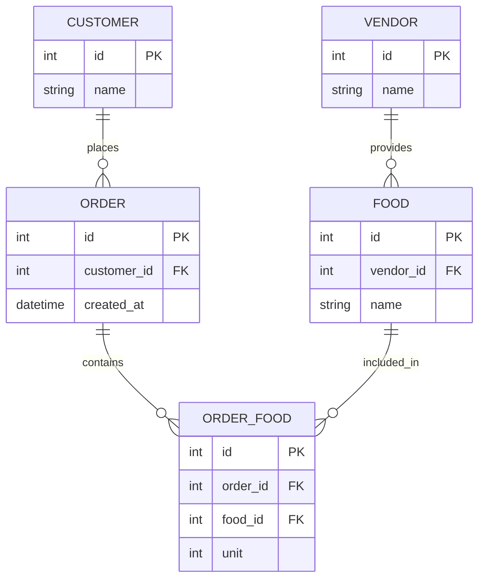

# Food Delivery App Database Design

### one to many relationship: -

1. customer create multiple order.
2. vendor create multiple foods.

### Many to Many relationship-

- in customer one order he select multiple food,
- one food e.g (fish) can stay in multiple order

## 📊 Database Schema

### SQL Schema (Relational)



### NoSQL Schema (MongoDB Example)

```javascript
// Customer Document
{
  _id: ObjectId,
  name: String,
  cart: [
    { foodId: ObjectId, unit: Number }
  ],
  orders: [ObjectId] // refs to Order
}

// Vendor Document
{
  _id: ObjectId,
  name: String,
  foods: [ObjectId] // refs to Food
}

// Food Document
{
  _id: ObjectId,
  vendorId: ObjectId, // ref to Vendor
  name: String,
  ...
}

// Order Document
{
  _id: ObjectId,
  customerId: ObjectId, // ref to Customer
  foods: [
    { foodId: ObjectId, unit: Number }
  ],
  ...
}
```
