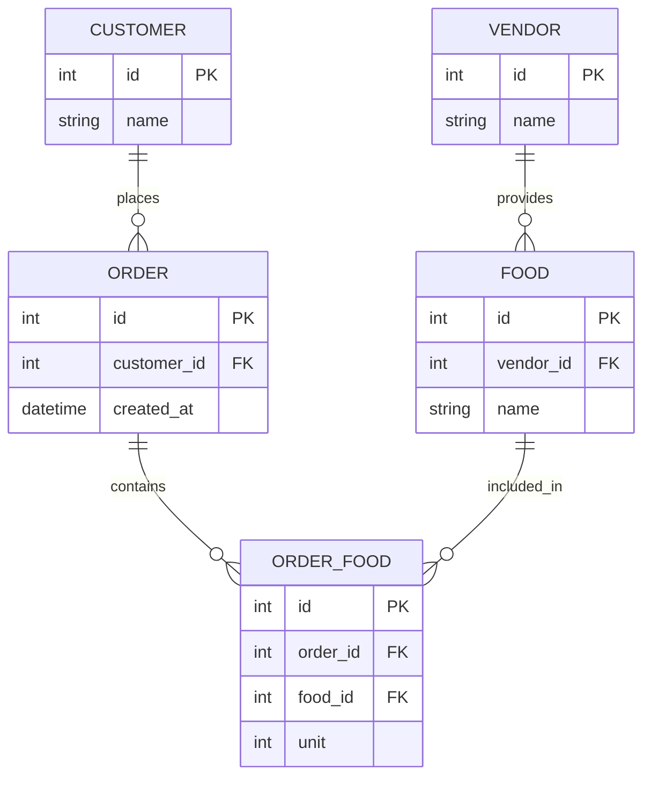

# Food Delivery App

A scalable, modular, and maintainable food delivery backend built with Node.js, TypeScript, Express, and MongoDB, following the Clean Architecture pattern.

## Clean Architecture

The codebase is organized in layers to enforce separation of concerns:

Core business models : - **Entities**

ODM : - **Mongoose model**

DBOperation : - **Repositories**

Business logic : - **Services**

Presentation : - **Controllers + DTOs**

## 📊 Database Schema

## Tech Stack

- Node.js, TypeScript, Express.js
- MongoDB (Mongoose ODM)
- Cloudinary (image upload)
- JWT authentication
- Winston logger
